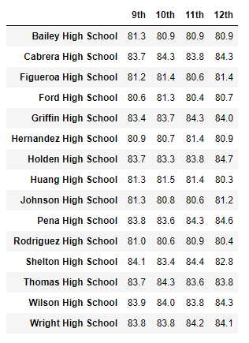

# School_District_Analysis

## Project Overview
Given the following task of preparing and analyzing the standardized test data of city school districts to create a report that provides insight about performance trends and patterns. 

## Resources 
- Data Source: schools_complete.csv, students_complete.csv 
- Software: Conda 4.8.3,  Python 3.7.7

## Summary - Deliverables
### Overall District and School Metrics
- District Summary

- School Summary

### School Performances and Average Math and Reading Scores
- Top 5 Performing Schools

- Bottom 5 Performing Schools

- Average Math Score per Grade Level 
  - 

- Average Reading Score per Grade Level 
  - 

- School Performance based on Budget Per Student 

- School Performance based on School Size 

- School Performance based on Type of School 

## Challenge Overview 
Request made to replace incorrect 9th-grade math and reading scores for Thomas High School and keep all other data associated with the 9th-grade students and Thomas High School intact.

## Challenge Summary
All 9th-grade math and reading scores for Thomas High School were replaced with the missing value placeholder called "NaN". After this update, a majority of the data was affected with a decrease from the updated information. 

The following changes had occured to the data:

### Updated Overall District and School Metrics
- District Summary 
  - The District Summary's average and percentages were affected in the following ways:
    - Average Math Score: 79.0 decrease to 78.9, changed by .1 point.
    - Average Reading Score: 81.9, no point change.
    - % Passing Math: 75 decrease to 74, changed by 1 percent. 
    - % Passing Reading: 86 decrease to 85, changed by 1 percent. 
    - % Overall Passing: 65 decrease to 64, changed by 1 percent. 

- School Summary
  - The only area affected in the overall School Summary was the information for Thomas High School itself. It's data was affected in the following ways: 
    - Average Math Score: 83.4 decrease to 83.3, changed by .1 point.
    - Average Reading Score: 83.8, no point change.
    - % Passing Math: 93.2 decrease to 66.9, changed by 26.3 percent. 
    - % Passing Reading: 97.3 decrease to 69.6, changed by 27.7 percent. 
    - % Overall Passing: 90.9 decrease to 65.0, changed by 25.9 percent. 
  - Previous Thomas High School Results
  
  - Updated Thomas High School Results
  

### Updated School Performances and Average Math and Reading Scores

- Top 5 Performing Schools 
  - Thomas High School had dropped from being the 2nd highest performing school, to 8th place. The rankings had shifted and allowed Wright High School to be within the Top 5. The bottom 5 rankings remained the same. 
  - Updated Top 5 Performing Schools. 
  

  
  - Updated Overall School Ranking

- Updated Average Math Score per Grade Level 
  - The only area affected for math was the 9th grade entry for Thomas High School, which is represented by the value "nan" for the missing value data. 
  - 

- Updated Average Reading Score per Grade Level 
  - The only area affected for reading was the 9th grade entry for Thomas High School, which is represented by the value "nan" for the missing value data. 
  - 

- Updated School Performance based on Budget Per Student 
  - The following areas were updated in the $630 - 644 spending range, where Thomas High School's budget lies in.
    - % Passing Math: 73 decrease to 67, changed by 6 percent. 
    - % Passing Reading: 84 decrease to 77, changed by 7 percent.
    - % Overall Passing: 63 decrease to 56, changed by 7 percent.

- Updated School Performance based on School Size 
  - The following areas were updated in the Medium (1000-2000) school size range, where Thomas High School's school size lies in.
    - % Passing Math: 94 decrease to 88, changed by 6 percent.
    - % Passing Reading: 97 decrease to 91, changed by 6 percent.
    - % Overall Passing: 91 decrease to 85, changed by 6 percent. 

- School Performance based on Type of School 
  - The following areas were updated in the Charter school type range, where Thomas High School's school type lies in.
    - % Passing Math: 94 decrease to 90, changed by 4 percent. 
    - % Passing Reading: 97 decrease to 93, changed by 4 percent. 
    - % Overall Passing: 90 decrease to 87, changed by 3 percent. 
 

